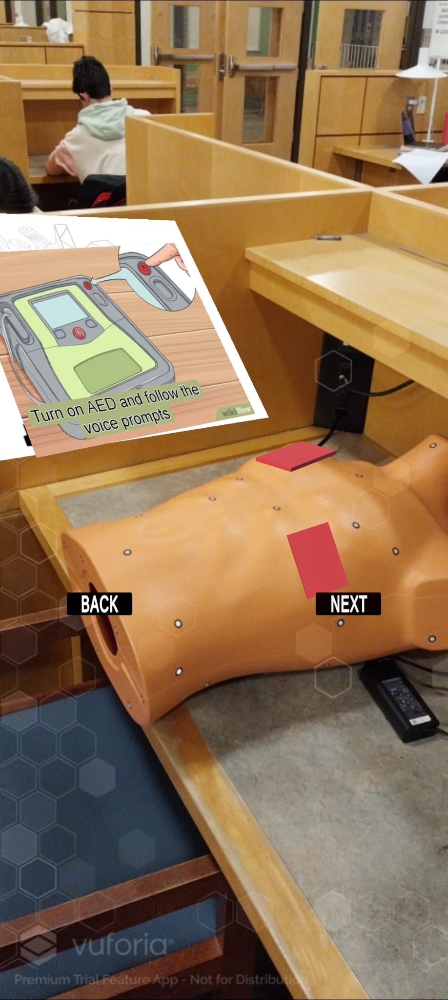
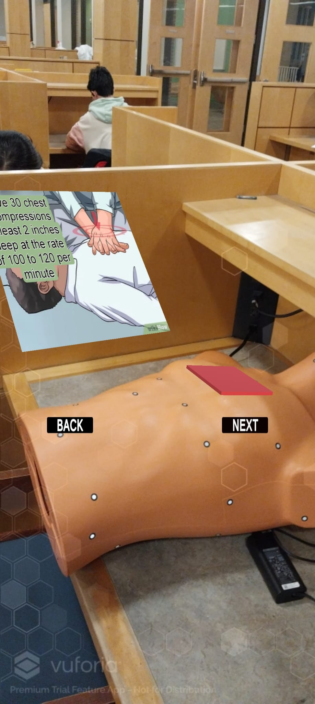

# LifeSavAR: An AR First Aid Guide

## Overview
LifeSavAR is an innovative Augmented Reality (AR) and Mixed Reality application tailored for Android and HoloLens2 platforms. It's designed to assist in emergency medical situations, offering guidance for CPR and Automated External Defibrillator (AED) usage, making it an essential tool for those individuals with limited or no medical training.

## Key Features
- **Platform Compatibility:** Fully deployable on Android devices and HoloLens 2 for wide accessibility.
- **Interactive Guidance:** Provides step-by-step AR instructions for performing CPR and using an AED, with visual prompts to ensure accuracy and confidence in emergencies.
- **Real-Time Assistance:** Uses AR technology to overlay precise instructions over the real-world environment, enhancing response effectiveness.
- **Educational Content:** Features comprehensive tutorials for life-saving techniques.
- **Emergency Preparedness:** Empowers users with crucial skills for moments where professional medical help isn't immediately available.

## Screenshots and Video Demonstration
### Android App Screenshots

  
   

### HoloLens Demonstration

## Technology Stack
- **Unity:** Core development environment for both Android and HoloLens apps.
- **Vuforia:** For AR functionalities, including Model Target Generator for the Torso phantom.
- **Mixed Reality Toolkit:** Employed for the HoloLens application development.

## Usage
### Android Application
- **Starting the App:** Install the app from the .apk provided.
- **Choosing a Mode:** Select the task you want to perform (CPR or AED).
- **Following AR Instructions:** Use the AR features for step-by-step assistance.

### HoloLens Application
- **Setting Up:** Deploy the app on your HoloLens from the Builds. 
- **Torso Phantom Detection:** Ensure that the entire torso of the phantom remains within your field of vision.
- **Navigating the Steps:** Use the AR features for step-by-step assistance.

## Versions Required
- **Unity:** Unity 2022 (LTS Support)
- **Visual Studio:** 2022
- **MRTK:** OpenXR Plugin and MRTK Foundation Tools Required

## Deployment
In order to deploy the project on your own Unity, you need to extract these folders in your Unity Hub, create an empty 3D Core Project, import MRTK and Vuforia packages and open the scenes or you can also import our unitypackage. We will gladly assist you in every step of the way.

## Connect with Us!
For more information, updates, or deployment assistance, you can connect with our team, and follow us on LinkedIn:
- [Kunal Kotkar](https://www.linkedin.com/in/kunal-kotkar/)
- [Sohan Gadiraju](https://www.linkedin.com/in/gadirajus/)

---

LifeSavAR is more than just an app; it's a potential life-saver in your pocket, designed to assist anyone, anywhere, in a medical emergency. Join us in making first aid more accessible and effective. In order to test the apps on your own devices, please contact me for the unitypackage and/or the apk file!
